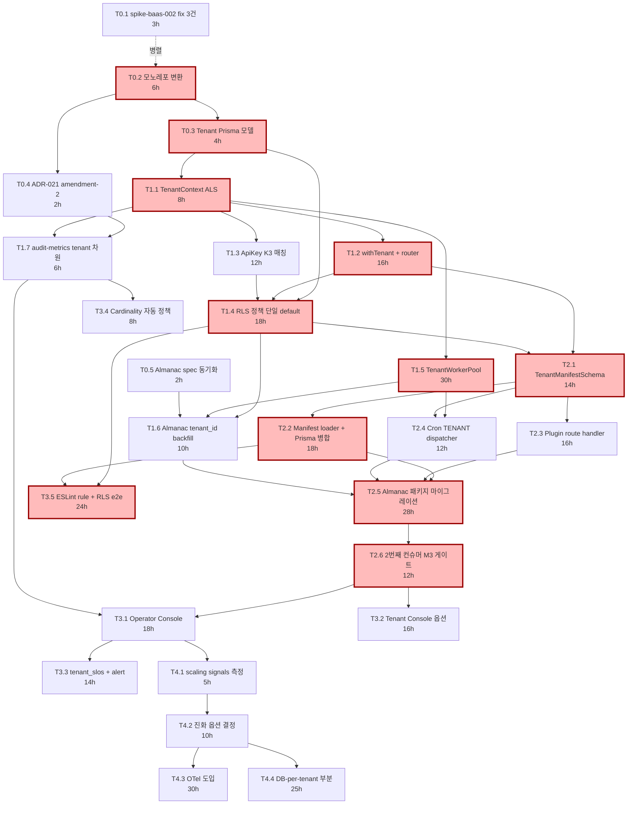

# 01 — Task DAG + 크리티컬 패스

> 작성: 2026-04-26 세션 58 (Sub-wave B)
> 짝 문서: `00-roadmap-overview.md`
> 목적: Phase 0~4의 모든 task를 DAG로 정리 + 크리티컬 패스 분석 + kdyswarm 병렬 발사 그룹 설계

---

## 0. 한 줄 요약

> 크리티컬 패스 = T0.2 모노레포(6h) → T0.3 Tenant 모델(4h) → T1.1 TenantContext(8h) → T1.2 withTenant 가드(16h) → T1.4 RLS 정책(18h) → T1.5 TenantWorkerPool(30h) → T2.1~2.4 Plugin 시스템(60h) → **T2.6 2번째 컨슈머 게이트(M3, 12h)** → T3.5 ESLint+RLS e2e(24h). **합계 178h, ~22~30주 (1인 8h/주)**. 병렬 발사로 단축 시 ~140h 가능.

---

## 1. 전체 Task DAG (Mermaid)



---

## 2. Phase별 Task 목록

### 2.1 Phase 0 — Foundation (5 tasks, 17h)

| Task | 이름 | 공수 | 의존 | 병렬 가능 그룹 | 산출물 |
|------|------|------|------|--------------|--------|
| T0.1 | spike-baas-002 부수 fix 3건 | 3h | — | G0a (단독 PR) | runner.ts/registry.ts patch |
| T0.2 | 모노레포 변환 (pnpm + turborepo) | 6h | — | G0a (T0.1과 병렬) | pnpm-workspace.yaml, turbo.json, apps/, packages/ |
| T0.3 | Tenant Prisma 모델 + 마이그레이션 | 4h | T0.2 | G0b | schema.prisma + migration |
| T0.4 | ADR-021 amendment-2 (audit_logs.tenant_id) | 2h | T0.2 | G0b (T0.3과 병렬) | amendment 문서 + migration |
| T0.5 | Almanac spec 동기화 (다른 터미널 노트) | 2h | — | G0a (T0.1, T0.2와 병렬) | aggregator-fixes 터미널 노트 |

### 2.2 Phase 1 — Tenant 1급화 (7 tasks, 100h)

| Task | 이름 | 공수 | 의존 | 병렬 가능 그룹 | 산출물 |
|------|------|------|------|--------------|--------|
| T1.1 | TenantContext (AsyncLocalStorage) | 8h | T0.3 | G1a | packages/core/src/tenant/context.ts |
| T1.2 | withTenant() 가드 + catch-all router | 16h | T1.1 | G1b | apps/web/app/api/v1/t/[tenant]/[...path]/route.ts |
| T1.3 | ApiKey K3 매칭 (prefix + FK) | 12h | T1.1 | G1b (T1.2와 병렬) | packages/core/src/auth/api-key.ts |
| T1.4 | RLS 정책 단일 tenant 'default' | 18h | T0.3, T1.2, T1.3 | G1c | RLS 정책 SQL + Prisma extension + e2e 5건 |
| T1.5 | TenantWorkerPool (worker_threads) | 30h | T1.1 | G1b (T1.2/T1.3과 병렬) | packages/core/src/cron/* |
| T1.6 | Almanac tenant_id 'almanac' backfill | 10h | T1.4, T1.5, T0.5 | G1d | content_* migration + alias |
| T1.7 | audit-metrics tenant 차원 | 6h | T1.1, T0.4 | G1b (T1.2/T1.3/T1.5와 병렬) | bucketName + audit-failure per-tenant |

### 2.3 Phase 2 — Plugin 1.0 (6 tasks, 100h)

| Task | 이름 | 공수 | 의존 | 병렬 가능 그룹 | 산출물 |
|------|------|------|------|--------------|--------|
| T2.1 | TenantManifestSchema + defineTenant() | 14h | T1.2, T1.4 | G2a | packages/core/src/tenant/manifest.ts (Zod) |
| T2.2 | Manifest loader + Prisma schema 병합 | 18h | T2.1 | G2b | scripts/merge-tenant-prisma-fragments.ts, scripts/load-tenant-manifests.ts |
| T2.3 | Plugin route handler 등록 | 16h | T2.1 | G2b (T2.2와 병렬) | apps/web/app/admin/[tenant]/* codegen |
| T2.4 | Cron TENANT kind dispatcher | 12h | T1.5, T2.1 | G2b (T2.2/T2.3과 병렬) | registry.ts + worker-script.ts TENANT 케이스 |
| T2.5 | Almanac → packages/tenant-almanac/ | 28h | T2.2, T2.3, T2.4, T1.6 | G2c | packages/tenant-almanac/* + manifest |
| T2.6 | **2번째 컨슈머 게이트 (M3)** | 12h | T2.5 | G2d (단독) | packages/tenant-<2nd>/manifest only |

### 2.4 Phase 3 — Self-service + 운영 (5 tasks, 80h)

| Task | 이름 | 공수 | 의존 | 병렬 가능 그룹 | 산출물 |
|------|------|------|------|--------------|--------|
| T3.1 | Operator Console (9 화면) | 18h | T2.6, T1.7 | G3a | apps/web/app/admin/operator/* |
| T3.2 | Tenant Console (옵션) | 16h | T2.6 | G3a (T3.1과 병렬) | apps/web/app/admin/[tenant]/console |
| T3.3 | tenant_slos + alert 알림 | 14h | T3.1 | G3b | tenant_slos 테이블 + breach cron + Discord/email webhook |
| T3.4 | Cardinality 자동 정책 | 8h | T1.7 | G3a (T3.1/T3.2와 병렬) | bucketName cap + Operator 경고 |
| T3.5 | ESLint custom rule + RLS e2e 20건 | 24h | T1.4, T2.2 | G3a (T3.1/T3.2/T3.4와 병렬) | eslint-plugin-yangpyeon + e2e suite |

### 2.5 Phase 4 — 진화 옵션 (4 tasks, 70h, 조건부)

| Task | 이름 | 공수 | 의존 | 트리거 | 산출물 |
|------|------|------|------|------|--------|
| T4.1 | scaling signals 측정 | 5h | T3.1 | M5 (N=10) | Operator Console 패널 |
| T4.2 | 진화 옵션 결정 (D/B) | 10h | T4.1 (4주 데이터) | M6 | ADR-025 amendment |
| T4.3 | OTel 도입 | 30h | T4.2 | M3+T2 트리거 | OTel exporter + tracing |
| T4.4 | DB-per-tenant 부분 | 25h | T4.2 | 큰 tenant 1~2개 | 분리 PG 인스턴스 + 라우팅 |

---

## 3. 크리티컬 패스 분석

### 3.1 가장 긴 의존 체인 (M3 게이트까지)

```
T0.2 모노레포 (6h)
  ↓
T0.3 Tenant 모델 (4h)
  ↓
T1.1 TenantContext (8h)
  ↓
T1.2 withTenant 가드 (16h)
  ↓
T1.4 RLS 정책 (18h)        ← T1.3 ApiKey 병렬
  ↓
T1.6 Almanac backfill (10h)  ← T1.5 WorkerPool 병렬
  ↓
T2.1 ManifestSchema (14h)
  ↓
T2.2 Manifest loader (18h)   ← T2.3, T2.4 병렬
  ↓
T2.5 Almanac 패키지 마이그레이션 (28h)
  ↓
T2.6 2번째 컨슈머 게이트 M3 (12h)
  ↓
T3.5 ESLint + RLS e2e (24h)
─────────────────────────
합계: 178h
```

### 3.2 단축 가능 task

| Task | 단축 방법 | 절감 |
|------|----------|------|
| T1.5 (30h) | spike-baas-002 §6 sketch 코드를 스타팅 포인트로 직접 사용 | -8h |
| T2.5 (28h) | Almanac 코드의 1:1 이동 (refactor 최소화) | -6h |
| T3.5 (24h) | ESLint rule을 community pkg(`@typescript-eslint`) 패턴 차용 | -4h |
| T1.4 (18h) | Prisma 공식 example `prisma-client-extensions/row-level-security` 그대로 적용 | -4h |

**단축 후 크리티컬 패스**: 178h → **~156h** (~20주)

### 3.3 병렬화 기회

크리티컬 패스가 아닌 task들:
- T0.1 (3h), T0.4 (2h), T0.5 (2h) → Phase 0에서 T0.2와 완전 병렬
- T1.3 (12h), T1.5 (30h), T1.7 (6h) → Phase 1에서 T1.2와 병렬 (T1.1 완료 후)
- T2.3 (16h), T2.4 (12h) → Phase 2에서 T2.2와 병렬
- T3.1, T3.2, T3.4, T3.5 → Phase 3에서 4개 동시 가능 (T2.6 후)

**총 task 공수 합 (Phase 0~3)**: 17 + 100 + 100 + 80 = **297h**
**크리티컬 패스 (병렬화 후)**: ~178h
**병렬 절감 비율**: 약 40%

---

## 4. kdyswarm 병렬 발사 그룹

### Group G0a — Phase 0 즉시 발사 (3 agent, 11h max)

| Agent | Task | 공수 | 작업 영역 |
|-------|------|------|----------|
| A0a-1 | T0.1 spike-baas-002 fix | 3h | src/lib/cron/* |
| A0a-2 | T0.2 모노레포 변환 | 6h | 전체 구조 (worktree 격리) |
| A0a-3 | T0.5 Almanac 동기화 노트 | 2h | aggregator-fixes 터미널 노트 작성 |

**충돌 위험**: A0a-1과 A0a-2 모두 src/lib/cron/ 영역 → A0a-2가 worktree로 격리하거나 A0a-1 머지 후 A0a-2 진행. **권장**: T0.1 단독 PR 머지 → T0.2 시작.

### Group G0b — Phase 0 후반 (2 agent, 4h max)

| Agent | Task | 공수 | 의존 |
|-------|------|------|------|
| A0b-1 | T0.3 Tenant 모델 | 4h | T0.2 |
| A0b-2 | T0.4 ADR-021 amendment-2 | 2h | T0.2 |

**병렬 안전**: 다른 prisma migration 파일 + 다른 ADR 문서.

### Group G1a — Phase 1 시작 (1 agent, 8h)

| Agent | Task | 공수 | 의존 |
|-------|------|------|------|
| A1a-1 | T1.1 TenantContext | 8h | T0.3 |

**단독 발사**: TenantContext가 Phase 1 모든 task의 전제. 안전하게 단독 머지.

### Group G1b — Phase 1 본진 (4 agent, 30h max)

| Agent | Task | 공수 | 작업 영역 |
|-------|------|------|----------|
| A1b-1 | T1.2 withTenant 가드 + router | 16h | apps/web/app/api/v1/t/* |
| A1b-2 | T1.3 ApiKey K3 | 12h | packages/core/src/auth/* |
| A1b-3 | T1.5 TenantWorkerPool | 30h | packages/core/src/cron/* |
| A1b-4 | T1.7 audit-metrics tenant 차원 | 6h | packages/core/src/audit-metrics.ts |

**충돌 안전**: 4개 모두 다른 디렉토리. worktree 권장.

### Group G1c — Phase 1 RLS 통합 (1 agent, 18h)

| Agent | Task | 공수 | 의존 |
|-------|------|------|------|
| A1c-1 | T1.4 RLS 정책 + e2e | 18h | T0.3, T1.2, T1.3 머지 후 |

**단독**: 모든 비즈니스 모델에 RLS 정책 추가 + Prisma extension은 충돌 위험 큼.

### Group G1d — Phase 1 마무리 (1 agent, 10h)

| Agent | Task | 공수 | 의존 |
|-------|------|------|------|
| A1d-1 | T1.6 Almanac backfill | 10h | T1.4, T1.5, T0.5 + Almanac main 머지 후 |

### Group G2a — Phase 2 시작 (1 agent, 14h)

| Agent | Task | 공수 |
|-------|------|------|
| A2a-1 | T2.1 ManifestSchema | 14h |

### Group G2b — Phase 2 본진 (3 agent, 18h max)

| Agent | Task | 공수 | 작업 영역 |
|-------|------|------|----------|
| A2b-1 | T2.2 Manifest loader + Prisma 병합 | 18h | scripts/* |
| A2b-2 | T2.3 Plugin route handler | 16h | apps/web/app/admin/[tenant]/* |
| A2b-3 | T2.4 Cron TENANT dispatcher | 12h | packages/core/src/cron/registry.ts |

### Group G2c — Phase 2 Almanac 마이그레이션 (1 agent, 28h)

| Agent | Task | 공수 |
|-------|------|------|
| A2c-1 | T2.5 Almanac → tenant-almanac 패키지 | 28h |

### Group G2d — M3 게이트 (1 agent, 12h)

| Agent | Task | 공수 |
|-------|------|------|
| A2d-1 | T2.6 2번째 컨슈머 manifest only | 12h |

**중요**: M3 게이트는 PR diff 검증이 핵심 → human review 권장 (자율 머지 금지).

### Group G3a — Phase 3 본진 (4 agent, 24h max)

| Agent | Task | 공수 | 작업 영역 |
|-------|------|------|----------|
| A3a-1 | T3.1 Operator Console | 18h | apps/web/app/admin/operator/* |
| A3a-2 | T3.2 Tenant Console (옵션) | 16h | apps/web/app/admin/[tenant]/console/* |
| A3a-3 | T3.4 Cardinality 자동 정책 | 8h | packages/core/src/audit-metrics.ts |
| A3a-4 | T3.5 ESLint + RLS e2e | 24h | tools/eslint-plugin/ + tests/e2e/rls/ |

### Group G3b — Phase 3 SLO (1 agent, 14h)

| Agent | Task | 공수 |
|-------|------|------|
| A3b-1 | T3.3 tenant_slos + alert | 14h |

---

## 5. kdyswarm 발사 시 권장 패턴

### 5.1 Group 단위 발사

```
[Phase 0]
G0a (3 agent 동시 worktree) → 머지 → G0b (2 agent 동시) → 머지

[Phase 1]
G1a (단독) → 머지 → G1b (4 agent 동시 worktree) → 머지 → G1c (단독, RLS) → 머지 → G1d (단독)

[Phase 2]
G2a (단독) → 머지 → G2b (3 agent 동시) → 머지 → G2c (단독, 큰 마이그레이션) → 머지 → G2d (단독, M3)

[Phase 3]
G3a (4 agent 동시) → 머지 → G3b (단독)
```

### 5.2 worktree 격리 필수 task

다음 task는 같은 디렉토리/파일을 건드릴 가능성 → worktree 권장:
- T0.1 vs T0.2 (둘 다 src/lib/cron/)
- T1.4 vs T1.5 (Prisma migration 충돌 가능)
- T2.2 vs T2.3 vs T2.4 (manifest 시스템 통합)
- T3.1 vs T3.2 (admin UI 컴포넌트 공유)

### 5.3 자율 실행 vs 사용자 확인

memory `feedback_autonomy` 준수:
- **자율 진행**: T0.1~T0.5, T1.1~T1.3, T1.5, T1.7, T2.1~T2.4, T3.1~T3.5
- **사용자 확인 필수** (파괴적/되돌리기 어려움):
  - T0.2 모노레포 변환 (전체 구조 변경)
  - T1.4 RLS 정책 (잘못 적용 시 데이터 유출)
  - T1.6 Almanac backfill (alias 종료 시점)
  - T2.5 Almanac 패키지 마이그레이션 (큰 코드 이동)
  - T2.6 M3 게이트 (PR diff 검증 + 정체성 입증)
  - T4.* 모두 (인스턴스 진화)

---

## 6. 추정 일정 (1인 운영자, 주 8~10h)

| Phase | 공수 | 직렬 시 (주) | 병렬 시 (주, kdyswarm 활용) |
|-------|------|------------|---------------------------|
| 0 | 17h | 2주 | 1.5주 (G0a 동시) |
| 1 | 100h | 12주 | 8주 (G1b 4 agent + G1c 단독) |
| 2 | 100h | 12주 | 9주 (G2b 3 agent + G2c/G2d 단독) |
| 3 | 80h | 10주 | 6주 (G3a 4 agent) |
| 4 | 70h (조건부) | 8주 | 5주 |
| **합계** | **367h** | **44주** | **~30주 (병렬화 +30%)** |

**참고**: 이 추정은 README에 있는 380~480h와 일치 (회고/문서/리뷰 시간 포함 시 상한 480h).

---

## 7. 의존성 매트릭스 (역방향 조회용)

각 task가 어떤 후속 task를 블록하는가 — 지연 시 영향도 파악용.

| Task | 직접 블록 | 간접 블록 (전체) | 블록 강도 |
|------|----------|----------------|----------|
| T0.2 | T0.3, T0.4 | 거의 모든 후속 task | **CRITICAL** |
| T0.3 | T1.1, T1.4 | Phase 1~3 전체 | **CRITICAL** |
| T0.4 | T1.7 | T3.4 | 중 |
| T0.5 | T1.6 | T2.5 | 저 (Almanac 한정) |
| T1.1 | T1.2, T1.3, T1.5, T1.7 | Phase 2~3 전체 | **CRITICAL** |
| T1.2 | T1.4, T2.1 | Phase 2~3 라우팅 | **CRITICAL** |
| T1.3 | T1.4 | Phase 2~3 인증 | 중 |
| T1.4 | T1.6, T2.1, T3.5 | Phase 2 전체 + RLS e2e | **CRITICAL** |
| T1.5 | T1.6, T2.4 | Cron 시스템 전체 | 중 |
| T1.6 | T2.5 | M3 게이트 | 중 |
| T1.7 | T3.1, T3.4 | 운영 가시화 | 중 |
| T2.1 | T2.2, T2.3, T2.4 | Plugin 시스템 전체 | **CRITICAL** |
| T2.2 | T2.5, T3.5 | M3 게이트 + ESLint | 중 |
| T2.3 | T2.5 | M3 게이트 | 중 |
| T2.4 | T2.5 | M3 게이트 | 중 |
| T2.5 | T2.6 | **M3 게이트** | **CRITICAL** |
| T2.6 | T3.1, T3.2 | Phase 3 전체 | **CRITICAL** |
| T3.1 | T3.3, T4.1 | SLO + Phase 4 | 중 |

**해석**:
- T0.2, T0.3, T1.1, T1.2, T1.4, T2.1, T2.5, T2.6 = CRITICAL → 지연 시 전체 일정 1:1 지연
- 나머지는 병렬 task의 일부 → 지연이 다른 그룹 작업으로 흡수 가능

---

## 8. 게이트별 검증 체크리스트

### 8.1 M1 (Phase 0 완료) 검증

```bash
# 1. 모노레포 빌드
pnpm install && pnpm build
# expect: 0 errors

# 2. Prisma 마이그레이션 상태
pnpm --filter @yangpyeon/core prisma migrate status
# expect: Database schema is up to date!

# 3. PM2 standalone 헬스체크 (회귀)
pnpm pack:standalone && pm2 start ecosystem.config.js
curl -sf http://localhost:3000/api/health
# expect: 200 OK

# 4. spike-baas-002 fix 3건 검증
grep -n "AbortController" src/lib/cron/runner.ts        # AGGREGATOR_FETCH_TIMEOUT 적용
grep -n "audit.*cron.failure" src/lib/cron/registry.ts  # silent failure audit
grep -n "TODO.*Phase 1.6" src/lib/cron/runner.ts        # ALLOWED_FETCH 마이그레이션 마커

# 5. Almanac spec 충돌 0건
git log --oneline spec/aggregator-fixes ^main | head
# expect: Almanac PR 진행 중, 본 브랜치와 conflict 0
```

### 8.2 M2 (Phase 1 완료) 검증

```bash
# 1. RLS e2e 5건
pnpm test tests/e2e/rls/cross-tenant-access.test.ts
# expect: 5/5 PASS, 0 leaks

# 2. Almanac MVP
curl -sf http://localhost:3000/api/v1/t/almanac/health
# expect: 200 OK

# 3. Cron 격리 (worker_threads)
pm2 logs --lines 100 | grep "worker.dispatch"
# expect: tenantId 라벨 포함, isolated execution 확인

# 4. audit_logs.tenant_id 채워짐
sqlite3 data/audit.db "SELECT COUNT(*) FROM audit_logs WHERE tenant_id IS NULL"
# expect: 0 (모든 row에 tenant_id 채워짐, Phase 1.7 backfill 후)

# 5. PM2 cluster:4 회귀
curl -s http://localhost:3000/api/admin/audit/health
# expect: pid 4개 모두 healthy
```

### 8.3 M3 (Phase 2 게이트, 가장 중요) 검증

```bash
# 1. PR diff 검증 (2번째 컨슈머 추가 PR)
git diff main...feat/tenant-<2nd> -- 'apps/web/' 'prisma/schema.prisma'
# expect: empty (변경 0줄)

git diff main...feat/tenant-<2nd> -- 'packages/tenant-<2nd>/'
# expect: 새 파일들 (manifest.ts, prisma/fragment.prisma, src/*)

# 2. 빌드 + manifest 충돌 검사
pnpm build && pnpm tsx scripts/validate-tenant-manifests.ts
# expect: All manifests valid, no conflicts

# 3. 가동 후 1주 audit 위반 0건
sqlite3 data/audit.db "
  SELECT COUNT(*) FROM audit_logs
  WHERE tenant_id = '<2nd>'
    AND severity IN ('error', 'critical')
    AND created_at >= datetime('now', '-7 days')
"
# expect: 0

# 4. Almanac 회귀 (alias 종료 후)
curl -s http://localhost:3000/api/v1/almanac/health
# expect: 410 Gone (alias 종료)

curl -sf http://localhost:3000/api/v1/t/almanac/health
# expect: 200 OK
```

### 8.4 M4 (Phase 3 완료) 검증

```bash
# 1. Operator Console 9 화면
for path in tenants tenants/detail crons audit slo-breach worker-pool ratelimit storage config; do
  curl -sf "http://localhost:3000/admin/operator/$path" | grep -c "status.*200"
done
# expect: 9개 모두 응답

# 2. SLO 측정
sqlite3 data/audit.db "SELECT COUNT(*) FROM tenant_slos"
# expect: >= 1 row

# 3. ESLint rule
pnpm lint
# expect: 0 'no-prisma-without-tenant' 위반

# 4. RLS e2e 20건
pnpm test tests/e2e/rls/
# expect: 20/20 PASS
```

---

## 9. 의사결정 질문 (DQ) 답변

| DQ# | 질문 | 답변 |
|-----|------|------|
| DQ-B.1 | Phase 0~4 각각의 exit criteria? | §00-roadmap-overview.md §2~§6 + 본 §8 |
| DQ-B.2 | task DAG의 크리티컬 패스는? | 본 §3.1 — T0.2 → T0.3 → T1.1 → T1.2 → T1.4 → T1.6 → T2.1 → T2.2 → T2.5 → T2.6 → T3.5 (178h) |

---

## 10. 변경 이력

- 2026-04-26 v0.1: 초안 작성 (Sub-wave B). 30 task DAG + 9 그룹 + 크리티컬 패스 분석 + 의존성 매트릭스 + 게이트별 검증 체크리스트.
